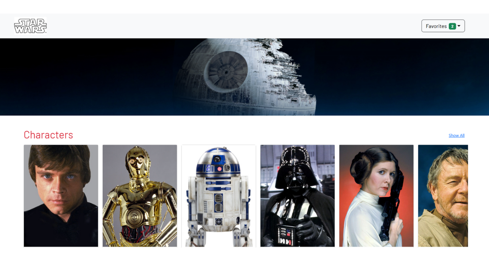

# 🌌 Blog Star Wars - React

Aplicación web desarrollada con **React** que consume datos de la API pública de Star Wars (**SWAPI**) para mostrar personajes, planetas y naves espaciales.  
Incluye navegación entre secciones, detalle de elementos, y un sistema de favoritos.

---

## 🚀 Tecnologías utilizadas

- **React** — Librería principal para la construcción de interfaces.
- **React Router DOM** — Manejo de rutas y navegación entre vistas.
- **Bootstrap 5** — Estilos y diseño responsivo.
- **Context API + useReducer** — Manejo de estado global para compartir datos entre componentes.
- **Hooks personalizados** (`useGlobalReducer`, `useFetchData`) — Lógica reutilizable para carga de datos y gestión de estado.
- **Fetch API** — Consumo de datos desde la API de SWAPI.

---

## 📂 Estructura del proyecto

src/
├── assets/        # Imágenes y recursos estáticos
├── components/    # Componentes reutilizables (Card, Navbar, Footer, etc.)
├── hooks/         # Hooks personalizados
├── pages/         # Páginas principales (Home, Single, ShowAll)
├── store/         # Estado global (Context + Reducer)
├── main.jsx       # Punto de entrada de la app
└── index.css      # Estilos globales

---

## ⚙️ Instalación y ejecución

1. **Clonar el repositorio**
  
   git clone https://github.com/4GeeksAcademy/AyeLecman-BlogStarWarsReact-pt55.git
   cd AyeLecman-BlogStarWarsReact-pt55

2. Instalar dependencias

npm install

3. Ejecutar 

npm run start

## 🖥️ Funcionalidades actuales
- Listado de personajes, planetas y naves de Star Wars.

- Navegación horizontal con scroll en la página principal.

- Vista detallada de cada elemento con información específica.

- Sistema de favoritos que se guarda en el estado global.

- Manejo de errores y carga de imágenes de reemplazo si no están disponibles.

- Diseño responsivo para pantallas grandes y móviles.

📸 **Capturas de pantalla**

.png)
.png)

🔄 **Diagrama de flujo de datos**

A[Componente Home] -->|Usa| B[useFetchData]
B -->|fetch API| C[(SWAPI)]
B -->|dispatch| D[Store Global]
D --> E[CardList]
E --> F[CardComponent]
F -->|Click en 'Learn More'| G[Single]
G -->|fetch API con ID| C
F -->|Click en 'Favorito'| D

📌 Explicación del flujo:

Home llama a useFetchData para obtener la data inicial de SWAPI.

Los resultados se guardan en el estado global mediante dispatch.

CardList renderiza las listas por tipo (people, planets, starships).

CardComponent muestra cada elemento y permite ir al detalle o agregarlo a favoritos.

Single vuelve a consultar la API para mostrar datos más completos.

## 🔮 Posibles mejoras y futuras implementaciones
--> Persistencia de favoritos en localStorage o IndexedDB para mantenerlos tras recargar la página.

--> Búsqueda y filtrado por nombre o categoría.

--> Paginación para manejar grandes cantidades de datos sin afectar el rendimiento.

--> Pruebas unitarias con Jest/React Testing Library.

--> Optimización de carga de imágenes para mejorar tiempos de respuesta.

--> Tema oscuro conmutando estilos dinámicamente.

### 💡 Desarrollado como parte del bootcamp de 4Geeks Academy